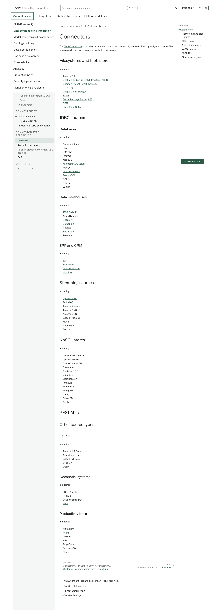

# Palantir

## Captura de pantalla

---

[Data connectivity & integration](/docs/foundry/data-integration/overview/)[Overview](/docs/foundry/data-integration/source-type-overview/)

# Connectors

The [Data Connection](/docs/foundry/data-connection/overview/) application is intended to provide connectivity between Foundry and your systems. This page provides an overview of the available connectors.

## Filesystems and blob stores

Including:

- [Amazon S3](/docs/foundry/available-connectors/amazon-s3/)
- [OneLake and Azure Blob Filesystem (ABFS)](/docs/foundry/available-connectors/onelake-and-azure-blob-filesystem/)
- [Directory (Agent-level filesystem)](/docs/foundry/available-connectors/filesystem/)
- [FTP/FTPS](/docs/foundry/available-connectors/ftps/)
- [Google Cloud Storage](/docs/foundry/available-connectors/google-cloud-storage/)
- [HDFS](/docs/foundry/available-connectors/hdfs/)
- [Server Message Block (SMB)](/docs/foundry/available-connectors/smb/)
- [SFTP](/docs/foundry/available-connectors/sftp/)
- [SharePoint Online](/docs/foundry/available-connectors/sharepoint-online/)

## [JDBC sources](/docs/foundry/available-connectors/custom-jdbc-sources/)

### Databases

Including:

- Amazon Athena
- Hive
- IBM Db2
- Informix
- MariaDB
- [Microsoft SQL Server](/docs/foundry/available-connectors/microsoft-sql-server/)
- MySQL
- [Oracle Database](/docs/foundry/available-connectors/oracle/)
- [PostgreSQL](/docs/foundry/available-connectors/postgresql/)
- SQLite
- Sybase
- Vertica

### Data warehouses

Including:

- [AWS Redshift](/docs/foundry/available-connectors/aws-redshift/)
- Azure Synapse
- [BigQuery](/docs/foundry/available-connectors/bigquery/)
- [Databricks](/docs/foundry/available-connectors/databricks/)
- Netezza
- [Snowflake](/docs/foundry/available-connectors/snowflake/)
- Teradata

### ERP and CRM

Including:

- [SAP](/docs/foundry/sap/install-sap/)
- [Salesforce](/docs/foundry/available-connectors/salesforce/)
- [Oracle NetSuite](/docs/foundry/available-connectors/netsuite-overview/)
- [HubSpot](/docs/foundry/available-connectors/hubspot/)

## [Streaming sources](/docs/foundry/data-integration/streaming-guide/)

Including:

- [Apache Kafka](/docs/foundry/available-connectors/kafka/)
- ActiveMQ
- [Amazon Kinesis](/docs/foundry/available-connectors/amazon-kinesis/)
- Amazon SNS
- Amazon SQS
- Google Pub/Sub
- MQTT
- RabbitMQ
- Solace

## [NoSQL stores](/docs/foundry/available-connectors/nosql-stores/)

Including:

- Amazon DynamoDB
- Apache HBase
- Azure Cosmos DB
- Cassandra
- Cockroach DB
- CouchDB
- Elasticsearch
- InfluxDB
- MarkLogic
- MongoDB
- Neo4j
- OrientDB
- Redis

## [REST APIs](/docs/foundry/available-connectors/rest-apis/)

## [Other source types](/docs/foundry/available-connectors/other-source-types/)

### IOT / IIOT

Including:

- Amazon IoT Core
- Azure Event Hub
- Google IoT Core
- OPC-UA
- OSI PI

### Geospatial systems

Including:

- ESRI / ArcGIS
- PostGIS
- Oracle Spatial DBs
- [WFS](/docs/foundry/available-connectors/wfs/)

### Productivity tools

Including:

- Artifactory
- [Asana](/docs/foundry/available-connectors/asana/)
- GitHub
- JIRA
- PagerDuty
- ServiceNOW
- [Slack](/docs/foundry/available-connectors/slack/)

[←

PREVIOUSConnectivity / Private links (VPC connectivity) / Customer-owned domain with Private Link](/docs/foundry/private-link/customer-owned-domain-private-link/)

[NEXTAvailable connectors / Act! CRM

→](/docs/foundry/available-connectors/act!-crm/)
