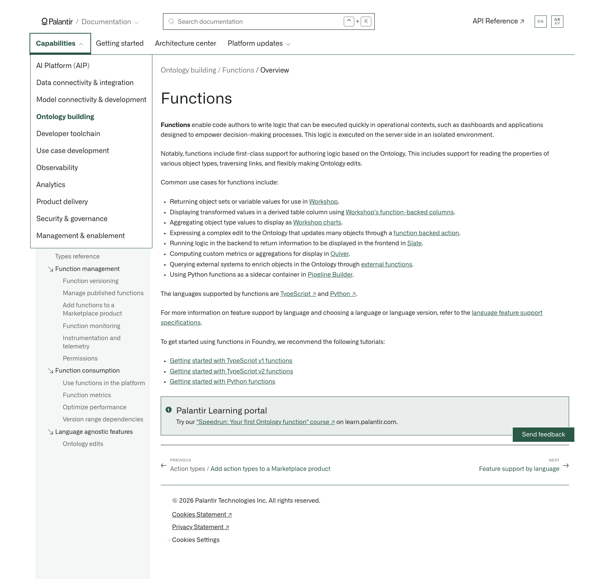

# Palantir

## Captura de pantalla

---

[Ontology building](/docs/foundry/ontology/overview/)[Functions](/docs/foundry/functions/overview/)[Overview](/docs/foundry/functions/overview/)

# Functions

**Functions** enable code authors to write logic that can be executed quickly in operational contexts, such as dashboards and applications designed to empower decision-making processes. This logic is executed on the server side in an isolated environment.

Notably, functions include first-class support for authoring logic based on the Ontology. This includes support for reading the properties of various object types, traversing links, and flexibly making Ontology edits.

Common use cases for functions include:

- Returning object sets or variable values for use in [Workshop](/docs/foundry/workshop/functions-use/).
- Displaying transformed values in a derived table column using [Workshop's function-backed columns](/docs/foundry/workshop/derived-properties/).
- Aggregating object type values to display as [Workshop charts](/docs/foundry/workshop/widgets-chart/#function-aggregations-function-backed-layers).
- Expressing a complex edit to the Ontology that updates many objects through a [function backed action](/docs/foundry/action-types/function-actions-overview/).
- Running logic in the backend to return information to be displayed in the frontend in [Slate](/docs/foundry/slate/overview/).
- Computing custom metrics or aggregations for display in [Quiver](/docs/foundry/quiver/overview/).
- Querying external systems to enrich objects in the Ontology through [external functions](/docs/foundry/functions/webhooks/).
- Using Python functions as a sidecar container in [Pipeline Builder](/docs/foundry/functions/python-functions-builder/).

The languages supported by functions are [TypeScript ↗](https://www.typescriptlang.org/docs/handbook/basic-types.html) and [Python ↗](https://www.python.org/).

For more information on feature support by language and choosing a language or language version, refer to the [language feature support specifications](/docs/foundry/functions/language-feature-support/).

To get started using functions in Foundry, we recommend the following tutorials:

- [Getting started with TypeScript v1 functions](/docs/foundry/functions/typescript-v1-getting-started/)
- [Getting started with TypeScript v2 functions](/docs/foundry/functions/typescript-v2-getting-started/)
- [Getting started with Python functions](/docs/foundry/functions/python-getting-started/)

Palantir Learning portal

Try our ["Speedrun: Your first Ontology function" course ↗](https://learn.palantir.com/speedrun-your-first-ontology-function) on learn.palantir.com.

[←

PREVIOUSAction types / Add action types to a Marketplace product](/docs/foundry/action-types/marketplace-action-types/)

[NEXTFeature support by language

→](/docs/foundry/functions/language-feature-support/)
