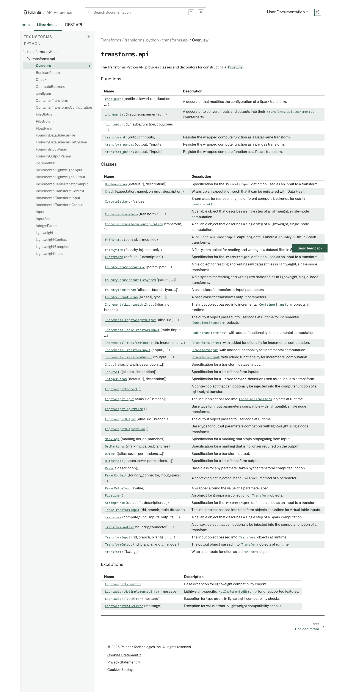

# Palantir

## Captura de pantalla

---

[Transforms](/docs/foundry/api-reference/transforms-python-library/api-overview/)transforms-python[transforms.api](/docs/foundry/api-reference/transforms-python-library/api-overview/)[Overview](/docs/foundry/api-reference/transforms-python-library/api-overview/)

# transforms.api

The Transforms Python API provides classes and decorators for constructing a [`Pipeline`](/docs/foundry/api-reference/transforms-python-library/api-pipeline/#transforms.api.Pipeline).

#### Functions

| Name | Description |
| --- | --- |
| [`configure`](/docs/foundry/api-reference/transforms-python-library/api-configure/#transforms.api.configure)([profile, allowed\_run\_duration, ...]) | A decorator that modifies the configuration of a Spark transform. |
| [`incremental`](/docs/foundry/api-reference/transforms-python-library/api-incremental/#transforms.api.incremental)([require\_incremental, ...]) | A decorator to convert inputs and outputs into their [`transforms.api.incremental`](/docs/foundry/api-reference/transforms-python-library/api-incremental/#transforms.api.incremental) counterparts. |
| [`lightweight`](/docs/foundry/api-reference/transforms-python-library/api-lightweight/#transforms.api.lightweight)([\_maybe\_function, cpu\_cores, ...]) |  |
| [`transform_df`](/docs/foundry/api-reference/transforms-python-library/api-transform-df/#transforms.api.transform_df)(output, \*\*inputs) | Register the wrapped compute function as a DataFrame transform. |
| [`transform_pandas`](/docs/foundry/api-reference/transforms-python-library/api-transform-pandas/#transforms.api.transform_pandas)(output, \*\*inputs) | Register the wrapped compute function as a pandas transform. |
| [`transform_polars`](/docs/foundry/api-reference/transforms-python-library/api-transform-polars/#transforms.api.transform_polars)(output, \*\*inputs) | Register the wrapped compute function as a Polars transform. |

#### Classes

| Name | Description |
| --- | --- |
| [`BooleanParam`](/docs/foundry/api-reference/transforms-python-library/api-booleanparam/#transforms.api.BooleanParam)(default, \*[, description]) | Specification for the `ParameterSpec` definition used as an input to a transform. |
| [`Check`](/docs/foundry/api-reference/transforms-python-library/api-check/#transforms.api.Check)(expectation, name[, on\_error, description]) | Wraps up an expectation such that it can be registered with Data Health. |
| [`ComputeBackend`](/docs/foundry/api-reference/transforms-python-library/api-computebackend/#transforms.api.ComputeBackend)(\*values) | Enum class for representing the different compute backends for use in [`configure()`](/docs/foundry/api-reference/transforms-python-library/api-configure/#transforms.api.configure). |
| [`ContainerTransform`](/docs/foundry/api-reference/transforms-python-library/api-containertransform/#transforms.api.ContainerTransform)(transform, \*[, ...]) | A callable object that describes a single step of a lightweight, single-node computation. |
| [`ContainerTransformsConfiguration`](/docs/foundry/api-reference/transforms-python-library/api-containertransformsconfiguration/#transforms.api.ContainerTransformsConfiguration)(transform, \*) | A callable object that describes a single step of a lightweight, single-node computation. |
| [`FileStatus`](/docs/foundry/api-reference/transforms-python-library/api-filestatus/#transforms.api.FileStatus)(path, size, modified) | A `collections.namedtuple` capturing details about a `FoundryFS` file in Spark transforms. |
| [`FileSystem`](/docs/foundry/api-reference/transforms-python-library/api-filesystem/#transforms.api.FileSystem)(foundry\_fs[, read\_only]) | A filesystem object for reading and writing raw dataset files in Spark transforms. |
| [`FloatParam`](/docs/foundry/api-reference/transforms-python-library/api-floatparam/#transforms.api.FloatParam)(default, \*[, description]) | Specification for the `ParameterSpec` definition used as an input to a transform. |
| [`FoundryDataSidecarFile`](/docs/foundry/api-reference/transforms-python-library/api-foundrydatasidecarfile/#transforms.api.FoundryDataSidecarFile)(param, path, ...) | A file object for reading and writing raw dataset files in lightweight, single-node transforms. |
| [`FoundryDataSidecarFileSystem`](/docs/foundry/api-reference/transforms-python-library/api-foundrydatasidecarfilesystem/#transforms.api.FoundryDataSidecarFileSystem)(param[, ...]) | A file system for reading and writing raw dataset files in lightweight, single-node transforms. |
| [`FoundryInputParam`](/docs/foundry/api-reference/transforms-python-library/api-foundryinputparam/#transforms.api.FoundryInputParam)(aliases[, branch, type, ...]) | A base class for transforms input parameters. |
| [`FoundryOutputParam`](/docs/foundry/api-reference/transforms-python-library/api-foundryoutputparam/#transforms.api.FoundryOutputParam)(aliases[, type, ...]) | A base class for transforms output parameters. |
| [`IncrementalLightweightInput`](/docs/foundry/api-reference/transforms-python-library/api-incrementallightweightinput/#transforms.api.IncrementalLightweightInput)(alias, rid[, branch]) | The input object passed into incremental [`ContainerTransform`](/docs/foundry/api-reference/transforms-python-library/api-containertransform/#transforms.api.ContainerTransform) objects at runtime. |
| [`IncrementalLightweightOutput`](/docs/foundry/api-reference/transforms-python-library/api-incrementallightweightoutput/#transforms.api.IncrementalLightweightOutput)(alias, rid[, ...]) | The output object passed into user code at runtime for incremental [`ContainerTransform`](/docs/foundry/api-reference/transforms-python-library/api-containertransform/#transforms.api.ContainerTransform) objects. |
| [`IncrementalTableTransformInput`](/docs/foundry/api-reference/transforms-python-library/api-incrementaltabletransforminput/#transforms.api.IncrementalTableTransformInput)(table\_tinput, ...) | [`TableTransformInput`](/docs/foundry/api-reference/transforms-python-library/api-tabletransforminput/#transforms.api.TableTransformInput) with added functionality for incremental computation. |
| [`IncrementalTransformContext`](/docs/foundry/api-reference/transforms-python-library/api-incrementaltransformcontext/#transforms.api.IncrementalTransformContext)(is\_incremental, ...) | [`TransformContext`](/docs/foundry/api-reference/transforms-python-library/api-transformcontext/#transforms.api.TransformContext) with added functionality for incremental computation. |
| [`IncrementalTransformInput`](/docs/foundry/api-reference/transforms-python-library/api-incrementaltransforminput/#transforms.api.IncrementalTransformInput)(tinput[, ...]) | [`TransformInput`](/docs/foundry/api-reference/transforms-python-library/api-transforminput/#transforms.api.TransformInput) with added functionality for incremental computation. |
| [`IncrementalTransformOutput`](/docs/foundry/api-reference/transforms-python-library/api-incrementaltransformoutput/#transforms.api.IncrementalTransformOutput)(toutput[, ...]) | [`TransformOutput`](/docs/foundry/api-reference/transforms-python-library/api-transformoutput/#transforms.api.TransformOutput) with added functionality for incremental computation. |
| [`Input`](/docs/foundry/api-reference/transforms-python-library/api-input/#transforms.api.Input)([alias, branch, description, ...]) | Specification for a transform dataset input. |
| [`InputSet`](/docs/foundry/api-reference/transforms-python-library/api-inputset/#transforms.api.InputSet)([aliases, description]) | Specification for a list of transform inputs. |
| [`IntegerParam`](/docs/foundry/api-reference/transforms-python-library/api-integerparam/#transforms.api.IntegerParam)(default, \*[, description]) | Specification for a `ParameterSpec` definition used as an input to a transform. |
| [`LightweightContext`](/docs/foundry/api-reference/transforms-python-library/api-lightweightcontext/#transforms.api.LightweightContext)() | A context object that can optionally be injected into the compute function of a lightweight transform. |
| [`LightweightInput`](/docs/foundry/api-reference/transforms-python-library/api-lightweightinput/#transforms.api.LightweightInput)(alias, rid[, branch]) | The input object passed into [`ContainerTransform`](/docs/foundry/api-reference/transforms-python-library/api-containertransform/#transforms.api.ContainerTransform) objects at runtime. |
| [`LightweightInputParam`](/docs/foundry/api-reference/transforms-python-library/api-lightweightinputparam/#transforms.api.LightweightInputParam)() | Base type for input parameters compatible with lightweight, single node transforms. |
| [`LightweightOutput`](/docs/foundry/api-reference/transforms-python-library/api-lightweightoutput/#transforms.api.LightweightOutput)(alias, rid[, branch]) | The output object passed to user code at runtime. |
| [`LightweightOutputParam`](/docs/foundry/api-reference/transforms-python-library/api-lightweightoutputparam/#transforms.api.LightweightOutputParam)() | Base type for output parameters compatible with lightweight, single node transforms. |
| [`Markings`](/docs/foundry/api-reference/transforms-python-library/api-markings/#transforms.api.Markings)(marking\_ids, on\_branches) | Specification for a marking that stops propagating from input. |
| [`OrgMarkings`](/docs/foundry/api-reference/transforms-python-library/api-orgmarkings/#transforms.api.OrgMarkings)(marking\_ids, on\_branches) | Specification for a marking that is no longer required on the output. |
| [`Output`](/docs/foundry/api-reference/transforms-python-library/api-output/#transforms.api.Output)([alias, sever\_permissions, ...]) | Specification for a transform output. |
| [`OutputSet`](/docs/foundry/api-reference/transforms-python-library/api-outputset/#transforms.api.OutputSet)([aliases, sever\_permissions, ...]) | Specification for a list of transform outputs. |
| [`Param`](/docs/foundry/api-reference/transforms-python-library/api-param/#transforms.api.Param)([description]) | Base class for any parameter taken by the transform compute function. |
| [`ParamContext`](/docs/foundry/api-reference/transforms-python-library/api-paramcontext/#transforms.api.ParamContext)(foundry\_connector, input\_specs, ...) | A context object injected in the `instance` method of a parameter. |
| [`ParamValueInput`](/docs/foundry/api-reference/transforms-python-library/api-paramvalueinput/#transforms.api.ParamValueInput)(value) | A wrapper around the value of a parameter spec. |
| [`Pipeline`](/docs/foundry/api-reference/transforms-python-library/api-pipeline/#transforms.api.Pipeline)() | An object for grouping a collection of [`Transform`](/docs/foundry/api-reference/transforms-python-library/api-transform/#transforms.api.Transform) objects. |
| [`StringParam`](/docs/foundry/api-reference/transforms-python-library/api-stringparam/#transforms.api.StringParam)(default, \*[, description, ...]) | Specification for the `ParameterSpec` definition used as an input to a transform. |
| [`TableTransformInput`](/docs/foundry/api-reference/transforms-python-library/api-tabletransforminput/#transforms.api.TableTransformInput)(rid, branch, table\_dfreader) | The input object passed into transform objects at runtime for virtual table inputs. |
| [`Transform`](/docs/foundry/api-reference/transforms-python-library/api-transform/#transforms.api.Transform)(compute\_func[, inputs, outputs, ...]) | A callable object that describes a single step of a Spark computation. |
| [`TransformContext`](/docs/foundry/api-reference/transforms-python-library/api-transformcontext/#transforms.api.TransformContext)(foundry\_connector[, ...]) | A context object that can optionally be injected into the compute function of a transform. |
| [`TransformInput`](/docs/foundry/api-reference/transforms-python-library/api-transforminput/#transforms.api.TransformInput)(rid, branch, txrange, ...[, ...]) | The input object passed into [`Transform`](/docs/foundry/api-reference/transforms-python-library/api-transform/#transforms.api.Transform) objects at runtime. |
| [`TransformOutput`](/docs/foundry/api-reference/transforms-python-library/api-transformoutput/#transforms.api.TransformOutput)(rid, branch, txrid, ...[, mode]) | The output object passed into [`Transform`](/docs/foundry/api-reference/transforms-python-library/api-transform/#transforms.api.Transform) objects at runtime. |
| [`transform`](/docs/foundry/api-reference/transforms-python-library/api-transform/#transforms.api.transform)(\*\*kwargs) | Wrap a compute function as a [`Transform`](/docs/foundry/api-reference/transforms-python-library/api-transform/#transforms.api.Transform) object. |

#### Exceptions

| Name | Description |
| --- | --- |
| [`LightweightException`](/docs/foundry/api-reference/transforms-python-library/api-lightweightexception/#transforms.api.LightweightException) | Base exception for lightweight compatibility checks. |
| [`LightweightNotImplementedError`](/docs/foundry/api-reference/transforms-python-library/api-lightweightnotimplementederror/#transforms.api.LightweightNotImplementedError)(message) | Lightweight-specific [`NotImplementedError` ↗](https://docs.python.org/3/library/exceptions.html#NotImplementedError) for unsupported features. |
| [`LightweightTypeError`](/docs/foundry/api-reference/transforms-python-library/api-lightweighttypeerror/#transforms.api.LightweightTypeError)(message) | Exception for type errors in lightweight compatibility checks. |
| [`LightweightValueError`](/docs/foundry/api-reference/transforms-python-library/api-lightweightvalueerror/#transforms.api.LightweightValueError)(message) | Exception for value errors in lightweight compatibility checks. |

[NEXTBooleanParam

→](/docs/foundry/api-reference/transforms-python-library/api-booleanparam/)
