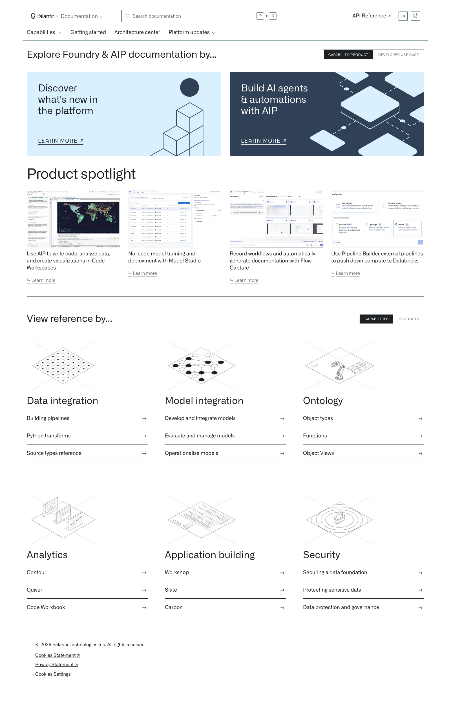
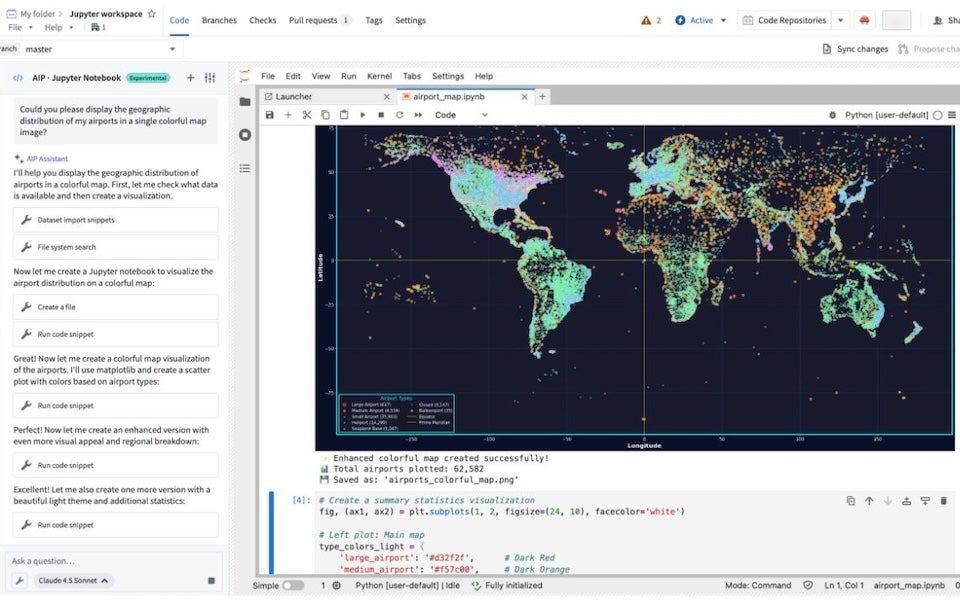
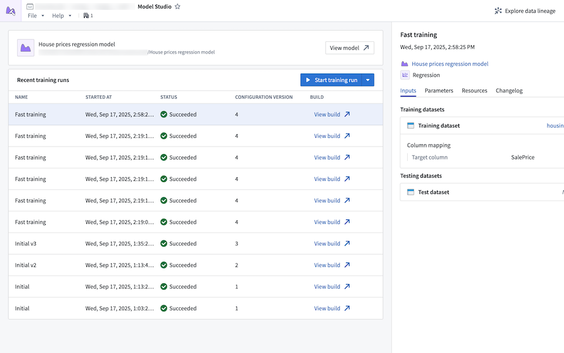
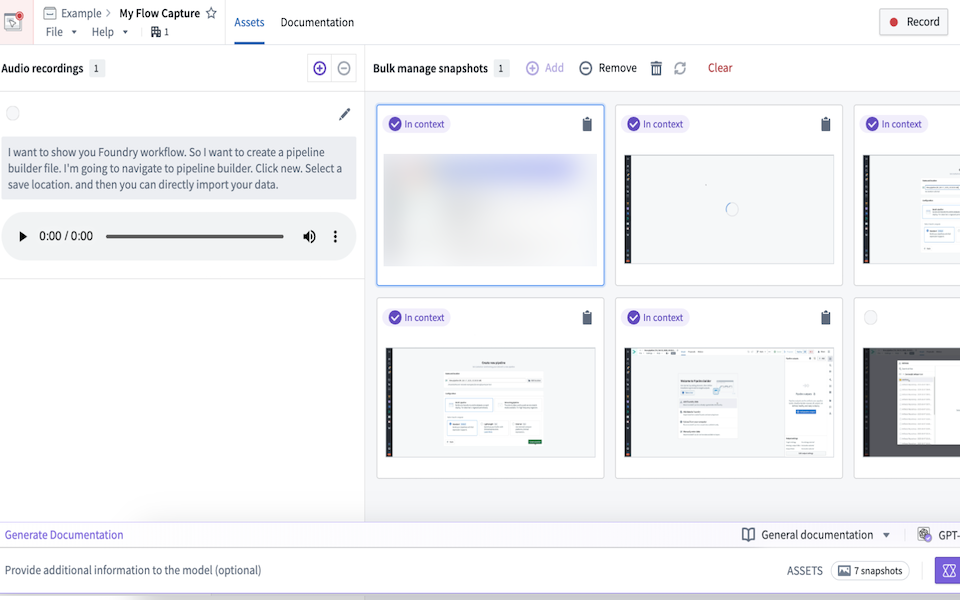
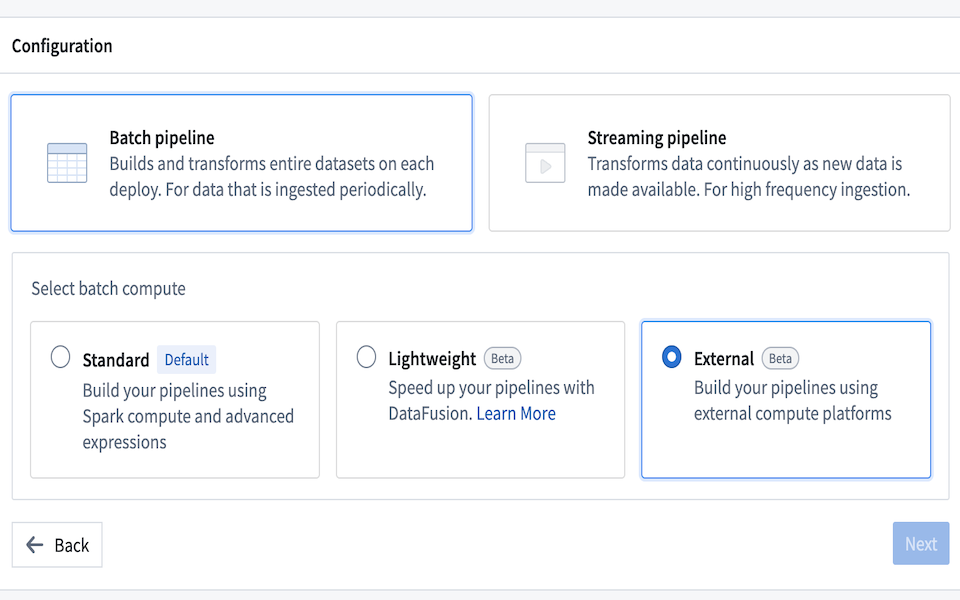
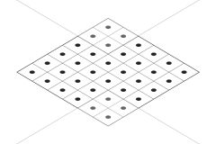
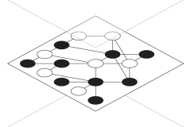

# Palantir

## Captura de pantalla

---

## Explore Foundry & AIP documentation by...

CAPABILITY/PRODUCTDEVELOPER USE CASE

[Discover what's new in the platform

Learn more](/docs/foundry/announcements/)

[Build AI agents & automations with AIP

Learn more](/docs/foundry/aip/overview/)

## Product spotlight

[

Use AIP to write code, analyze data, and create visualizations in Code Workspaces

 Learn more](/docs/foundry/announcements/2025-11/#use-aip-to-write-code-analyze-data-and-create-visualizations-in-jupyterlab-and-rstudio-code-workspaces)

[

No-code model training and deployment with Model Studio

 Learn more](/docs/foundry/announcements/2025-10/#no-code-model-training-and-deployment-with-model-studio)

[

Record workflows and automatically generate documentation with Flow Capture

 Learn more](/docs/foundry/announcements/2025-10/#record-workflows-and-automatically-generate-documentation-with-flow-capture)

[

Use Pipeline Builder external pipelines to push down compute to Databricks

 Learn more](/docs/foundry/announcements/2025-11/#use-pipeline-builder-external-pipelines-to-push-down-compute-to-databricks)

##

### View reference by...

CAPABILITIESPRODUCTS

[

## Data integration](/docs/foundry/data-integration/overview/)

[Building pipelines](/docs/foundry/building-pipelines/overview/)

[Python transforms](/docs/foundry/transforms-python/transforms-python-api/)

[Source types reference](/docs/foundry/data-integration/source-type-overview/)

[

## Model integration](/docs/foundry/model-integration/overview/)

[Develop and integrate models](/docs/foundry/integrate-models/integrate-overview/)

[Evaluate and manage models](/docs/foundry/evaluate-models/model-evaluation-automatic/)

[Operationalize models](/docs/foundry/model-integration/objectives/)

[

## Ontology](/docs/foundry/ontology/overview/)

[Object types](/docs/foundry/object-link-types/object-types-overview/)

[Functions](/docs/foundry/functions/overview/)

[Object Views](/docs/foundry/object-views/overview/)

[

## Analytics](/docs/foundry/analytics/overview/)

[Contour](/docs/foundry/contour/overview/)

[Quiver](/docs/foundry/quiver/overview/)

[Code Workbook](/docs/foundry/code-workbook/overview/)

[

## Application building](/docs/foundry/app-building/overview/)

[Workshop](/docs/foundry/workshop/overview/)

[Slate](/docs/foundry/slate/overview/)

[Carbon](/docs/foundry/carbon/overview/)

[

## Security](/docs/foundry/security/overview/)

[Securing a data foundation](/docs/foundry/security/securing-a-data-foundation/)

[Protecting sensitive data](/docs/foundry/security/protecting-sensitive-data/)

[Data protection and governance](/docs/foundry/security/data-protection-and-governance/)
