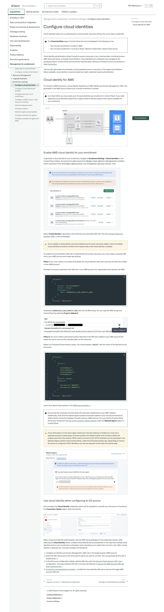
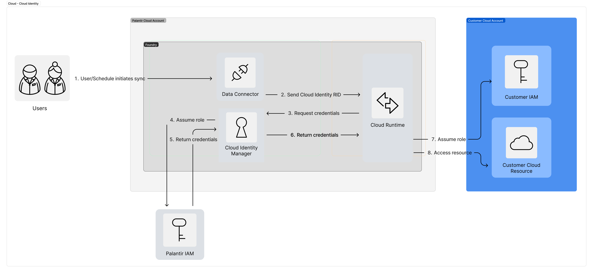
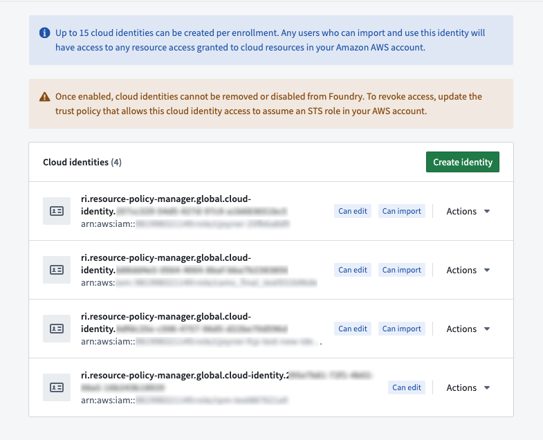
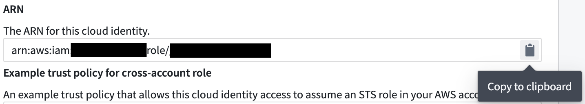
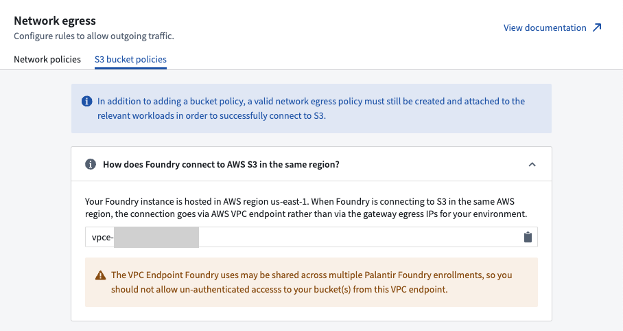
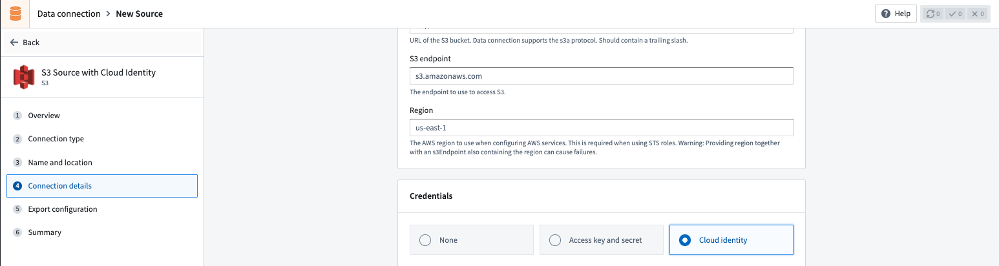

# Palantir

## Captura de pantalla



---

[Management & enablement](/docs/foundry/administration/overview/)Enrollment settings[Configure cloud identities](/docs/foundry/administration/configure-cloud-identities/)

# Configure cloud identities

Cloud identities allow you to authenticate to cloud provider resources without the use of static credentials.

The **Cloud identities** page in Control Panel will only be displayed if the following is true:

- Your Foundry enrollment is hosted in AWS.
- Your Foundry enrollment is running on Rubix, Palantir's Kubernetes-based infrastructure.

Cloud identity authentication allows Foundry to access resources in your cloud provider, including Amazon AWS, Microsoft Azure, or Google Cloud Platform. Cloud identities are configured and managed at the [enrollment](/docs/foundry/administration/enrollments-and-organizations/) level in Control Panel and should be imported when setting up individual source connections in [Data Connection](/docs/foundry/data-connection/overview/).

The Foundry-generated cloud identity must be granted access to resources in the target cloud platform. Where available, cloud identity is recommended over static credential-based authentication.

## Cloud identity for AWS

For access to AWS resources, a cloud identity represents an AWS Identity and Access Management (IAM) role generated in the AWS account where your Foundry enrollment is hosted.

As of April 2024, you may create up to 15 cloud identities per enrollment in Control Panel. If you need additional cloud identities, please file a support ticket to discuss options that may be available for your enrollment.



### Enable AWS cloud identity for your enrollment

To generate a cloud identity for your enrollment, navigate to **Enrollment Settings > Cloud Identities** in the Control Panel sidebar. Accessing this page requires the `Manage cloud identity configuration` workflow which is granted to the `Enrollment administrator` and `Information security officer` roles.



Select **Create Identity** to generate a cloud identity and associated IAM role. The role's [Amazon Resource Number (ARN) ↗](https://docs.aws.amazon.com/IAM/latest/UserGuide/reference_identifiers.html#identifiers-arns) will be displayed.

Once created, a cloud identity cannot be deleted and its name cannot be edited. Users of multiple cloud identities should be mindful of the reasons why a new cloud identity is needed.

To enable the cloud identity's IAM role to authenticate and access resources, you must create a separate IAM role in your AWS account and create two policies.

**Policy 1:** You must create a trust policy that allows the cloud identity's IAM role to assume the IAM role created in your AWS account.

Example trust policy, attached to the IAM role in your AWS account, for a generated cloud identity role ARN:

```
Copied!

1{
2   "Statement":
3   [
4      {
5         "Action": "sts:AssumeRole",
6         "Effect": "Allow",
7         "Principal": {
8            "AWS": "$GENERATED_CLOUD_IDENTITY_ARN",
9         },
10      }
11   ],
12   "Version": "2012-10-17"
13}
```

Substitute `$GENERATED_CLOUD_IDENTITY_ARN` with the full ARN string. You can copy the ARN string from Control Panel by selecting **Copy to clipboard**.



**Policy 2:** You must create a permissions policy attached to the IAM role created in your AWS account that allows the role to carry out the intended tasks on the resources.

Below is an example S3 permissions policy. You should replace `$BUCKET` with the name of the desired source S3 bucket.

```
Copied!

1{
2   "Statement":
3   [
4      {
5         "Action":
6         [
7            "s3:GetObject",
8            "s3:ListBucket",
9            "s3:DeleteObject",
10            "s3:PutObject"
11         ],
12         "Effect": "Allow",
13         "Resource":
14         [
15            "arn:aws:s3:::$BUCKET",
16            "arn:aws:s3:::$BUCKET/*"
17         ]
18      }
19   ],
20   "Version": "2012-10-17"
21}
```

Learn more about these policies in the [AWS documentation ↗](https://docs.aws.amazon.com/IAM/latest/UserGuide/id_roles_terms-and-concepts.html#:~:text=To%20delegate%20permission,assume%20the%20role.).

Ensure that the necessary Foundry Rubix IPs have been allowlisted on your AWS network. Additionally, verify that the relevant egress policies have been added to your Foundry enrollment to allow a direct connection between Foundry and your AWS account. You can find the Foundry Rubix IPs for your enrollment and [set up the necessary egress policies](/docs/foundry/administration/configure-egress/) under the **Network Egress** option in Control Panel.

If your S3 bucket is in the same region where your Foundry instance is hosted, you must use a separate process to allow egress to those buckets; the network traffic from Foundry’s Rubix will instead come from the Amazon VPCE used to connect to S3. VPCE identifiers can be accessed in the Network Egress section of the Control Panel, under the S3 bucket policies tab. Depending on how an S3 source is configured, VPCE identifiers can also be exposed via the Data Connection app.



### Use cloud identity when configuring an S3 source

Once enabled, the **Cloud identity** credentials option will be available to use with your S3 source in Foundry on the **Connection details** page in Data Connection.



When using cloud identity authentication, the role ARN will be displayed in the credentials section. After selecting the **Cloud identity** option, a default cloud identity will be preselected. In the case that multiple cloud identities exist on your enrollment, a dropdown menu will allow you to select from one from a list. After a cloud identity is selected, you must also configure the following:

1. Configure an Identity and Access Management (IAM) role in the target Amazon AWS account.
2. Grant the IAM role access to the S3 bucket to which you wish to connect. You can generally do this with a [bucket policy ↗](https://docs.aws.amazon.com/AmazonS3/latest/userguide/bucket-policies.html).
3. In the S3 source configuration details, add the IAM role under the [Security Token Service (STS) role ↗](https://docs.aws.amazon.com/STS/latest/APIReference/API_AssumeRole.html) configuration. The cloud identity IAM role in Foundry will attempt to [assume the AWS Account IAM role when accessing S3 ↗](https://docs.aws.amazon.com/STS/latest/APIReference/API_AssumeRole.html).
4. [Configure a corresponding trust policy ↗](https://docs.aws.amazon.com/IAM/latest/UserGuide/id_roles_manage.html) to allow the cloud identity IAM role to assume the target AWS account IAM role.

[←

PREVIOUSUpgrade Assistant / Maintenance Operators](/docs/foundry/upgrade-assistant/technical-maintenance-operators/)

[NEXTConfigure Code Workbook profiles

→](/docs/foundry/administration/configure-code-workbook-profiles/)
