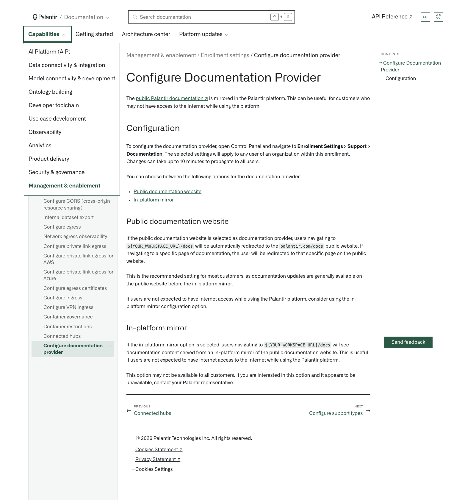

# Palantir

## Captura de pantalla

---

[Management & enablement](/docs/foundry/administration/overview/)Enrollment settings[Configure documentation provider](/docs/foundry/administration/configure-documentation-provider/)

# Configure Documentation Provider

The [public Palantir documentation ↗](https://www.palantir.com/docs) is mirrored in the Palantir platform. This can be useful for customers who may not have access to the Internet while using the platform.

## Configuration

To configure the documentation provider, open Control Panel and navigate to **Enrollment Settings > Support > Documentation**. The selected settings will apply to any user of an organization within this enrollment. Changes can take up to 10 minutes to propagate to all users.

You can choose between the following options for the documentation provider:

- [Public documentation website](#public-documentation-website)
- [In-platform mirror](#in-platform-mirror)

### Public documentation website

If the public documentation website is selected as documentation provider, users navigating to `${YOUR_WORKSPACE_URL}/docs` will be automatically redirected to the `palantir.com/docs` public website. If navigating to a specific page of documentation, the user will be redirected to that specific page on the public website.

This is the recommended setting for most customers, as documentation updates are generally available on the public website before the in-platform mirror.

If users are not expected to have Internet access while using the Palantir platform, consider using the in-platform mirror configuration option.

### In-platform mirror

If the in-platform mirror option is selected, users navigating to `${YOUR_WORKSPACE_URL}/docs` will see documentation content served from an in-platform mirror of the public documentation website. This is useful if users are not expected to have Internet access to the Internet while using the Palantir platform.

This option may not be available to all customers. If you are interested in this option and it appears to be unavailable, contact your Palantir representative.

[←

PREVIOUSConnected hubs](/docs/foundry/administration/connected-hubs/)

[NEXTConfigure support types

→](/docs/foundry/administration/configure-support-types/)
