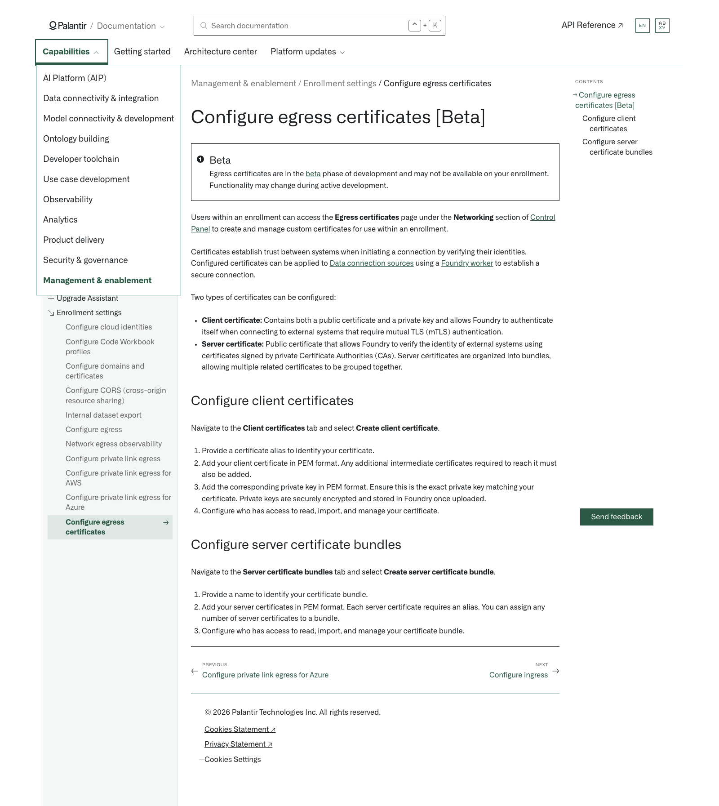

# Palantir

## Captura de pantalla

---

[Management & enablement](/docs/foundry/administration/overview/)Enrollment settings[Configure egress certificates](/docs/foundry/administration/configure-egress-certificates/)

# Configure egress certificates [Beta]

Beta

Egress certificates are in the [beta](/docs/foundry/platform-overview/development-life-cycle/) phase of development and may not be available on your enrollment. Functionality may change during active development.

Users within an enrollment can access the **Egress certificates** page under the **Networking** section of [Control Panel](/docs/foundry/administration/overview/) to create and manage custom certificates for use within an enrollment.

Certificates establish trust between systems when initiating a connection by verifying their identities. Configured certificates can be applied to [Data connection sources](/docs/foundry/data-connection/set-up-source/) using a [Foundry worker](/docs/foundry/data-connection/core-concepts/#foundry-worker) to establish a secure connection.

Two types of certificates can be configured:

- **Client certificate:** Contains both a public certificate and a private key and allows Foundry to authenticate itself when connecting to external systems that require mutual TLS (mTLS) authentication.
- **Server certificate:** Public certificate that allows Foundry to verify the identity of external systems using certificates signed by private Certificate Authorities (CAs). Server certificates are organized into bundles, allowing multiple related certificates to be grouped together.

## Configure client certificates

Navigate to the **Client certificates** tab and select **Create client certificate**.

1. Provide a certificate alias to identify your certificate.
2. Add your client certificate in PEM format. Any additional intermediate certificates required to reach it must also be added.
3. Add the corresponding private key in PEM format. Ensure this is the exact private key matching your certificate. Private keys are securely encrypted and stored in Foundry once uploaded.
4. Configure who has access to read, import, and manage your certificate.

## Configure server certificate bundles

Navigate to the **Server certificate bundles** tab and select **Create server certificate bundle**.

1. Provide a name to identify your certificate bundle.
2. Add your server certificates in PEM format. Each server certificate requires an alias. You can assign any number of server certificates to a bundle.
3. Configure who has access to read, import, and manage your certificate bundle.

[←

PREVIOUSConfigure private link egress for Azure](/docs/foundry/administration/configure-private-link-egress-azure/)

[NEXTConfigure ingress

→](/docs/foundry/administration/configure-ingress/)
