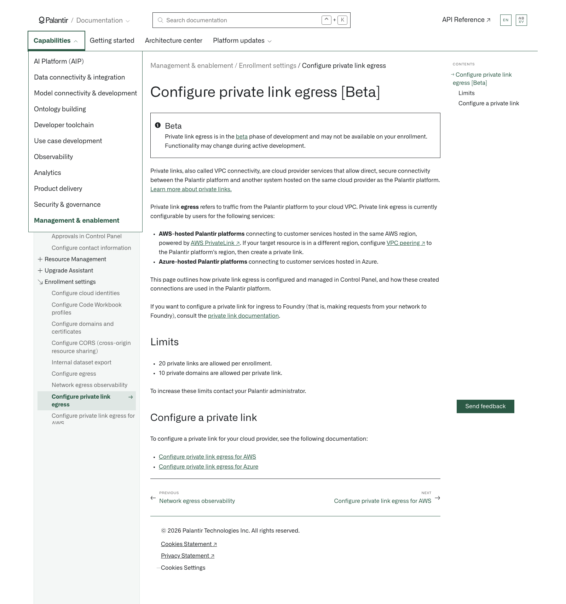

# Palantir

## Captura de pantalla

---

[Management & enablement](/docs/foundry/administration/overview/)Enrollment settings[Configure private link egress](/docs/foundry/administration/configure-private-link-egress/)

# Configure private link egress [Beta]

Beta

Private link egress is in the [beta](/docs/foundry/platform-overview/development-life-cycle/) phase of development and may not be available on your enrollment. Functionality may change during active development.

Private links, also called VPC connectivity, are cloud provider services that allow direct, secure connectivity between the Palantir platform and another system hosted on the same cloud provider as the Palantir platform. [Learn more about private links.](/docs/foundry/private-link/overview/)

Private link **egress** refers to traffic from the Palantir platform to your cloud VPC. Private link egress is currently configurable by users for the following services:

- **AWS-hosted Palantir platforms** connecting to customer services hosted in the same AWS region, powered by [AWS PrivateLink ↗](https://docs.aws.amazon.com/vpc/latest/privatelink/what-is-privatelink.html). If your target resource is in a different region, configure [VPC peering ↗](https://docs.aws.amazon.com/vpc/latest/peering/what-is-vpc-peering.html) to the Palantir platform's region, then create a private link.
- **Azure-hosted Palantir platforms** connecting to customer services hosted in Azure.

This page outlines how private link egress is configured and managed in Control Panel, and how these created connections are used in the Palantir platform.

If you want to configure a private link for ingress to Foundry (that is, making requests from your network *to* Foundry), consult the [private link documentation](/docs/foundry/private-link/overview/).

## Limits

- 20 private links are allowed per enrollment.
- 10 private domains are allowed per private link.

To increase these limits contact your Palantir administrator.

## Configure a private link

To configure a private link for your cloud provider, see the following documentation:

- [Configure private link egress for AWS](/docs/foundry/administration/configure-private-link-egress-aws/)
- [Configure private link egress for Azure](/docs/foundry/administration/configure-private-link-egress-azure/)

[←

PREVIOUSNetwork egress observability](/docs/foundry/administration/network-egress-observability/)

[NEXTConfigure private link egress for AWS

→](/docs/foundry/administration/configure-private-link-egress-aws/)
