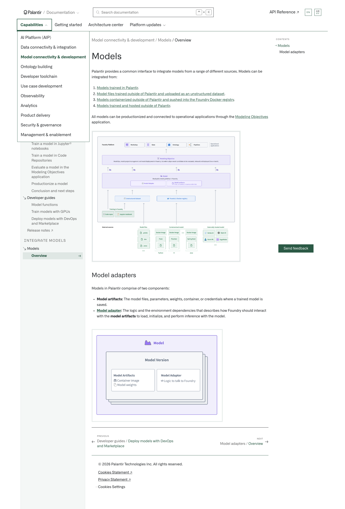
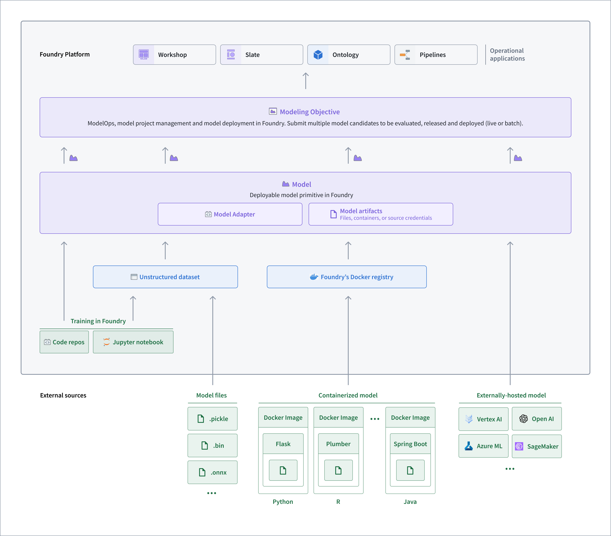
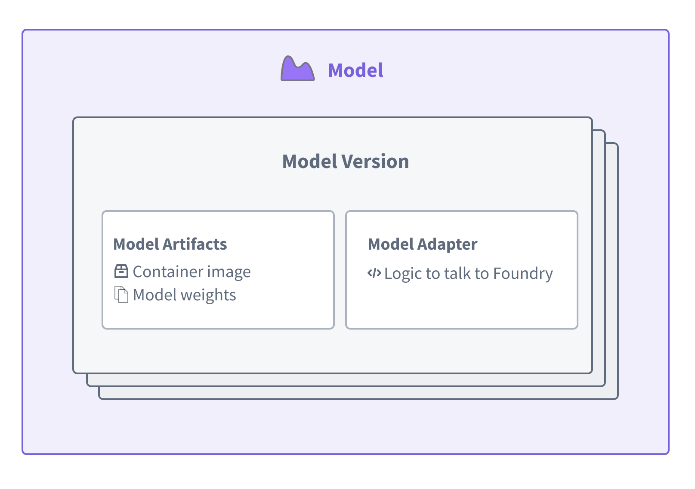

# Palantir

## Captura de pantalla

---

[Model connectivity & development](/docs/foundry/model-integration/overview/)[Models](/docs/foundry/integrate-models/integrate-overview/)[Overview](/docs/foundry/integrate-models/integrate-overview/)

# Models

Palantir provides a common interface to integrate models from a range of different sources. Models can be integrated from:

1. [Models trained in Palantir](/docs/foundry/integrate-models/model-asset-code-repositories/).
2. [Model files trained outside of Palantir and uploaded as an unstructured dataset](/docs/foundry/integrate-models/model-asset-files/).
3. [Models containerized outside of Palantir and pushed into the Foundry Docker registry](/docs/foundry/integrate-models/container-overview/).
4. [Models trained and hosted outside of Palantir](/docs/foundry/integrate-models/external-model-connection/).

All models can be productionized and connected to operational applications through the [Modeling Objectives](/docs/foundry/model-integration/objectives/) application.

## Model adapters

Models in Palantir comprise of two components:

- **Model artifacts:** The model files, parameters, weights, container, or credentials where a trained model is saved.
- **[Model adapter](/docs/foundry/integrate-models/model-adapter-overview/):** The logic and the environment dependencies that describes how Foundry should interact with the **model artifacts** to load, initialize, and perform inference with the model.

[←

PREVIOUSDeveloper guides / Deploy models with DevOps and Marketplace](/docs/foundry/model-integration/marketplace-models/)

[NEXTModel adapters / Overview

→](/docs/foundry/integrate-models/model-adapter-overview/)
